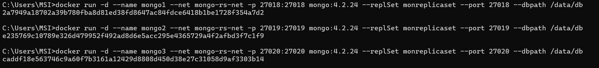
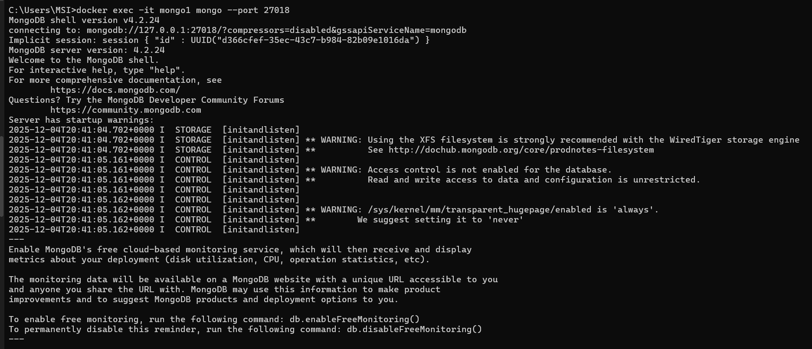
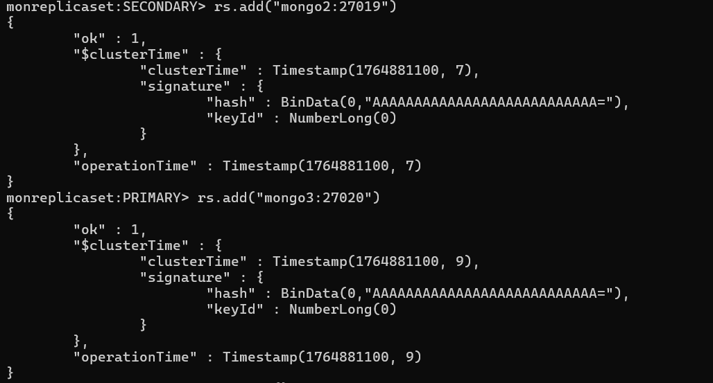
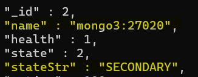
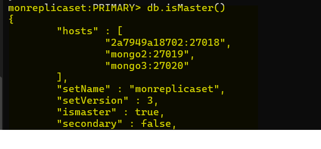
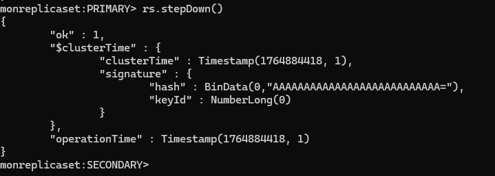
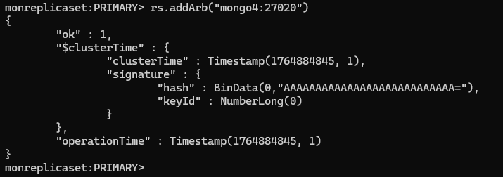
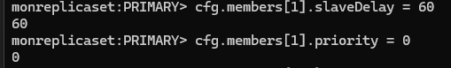
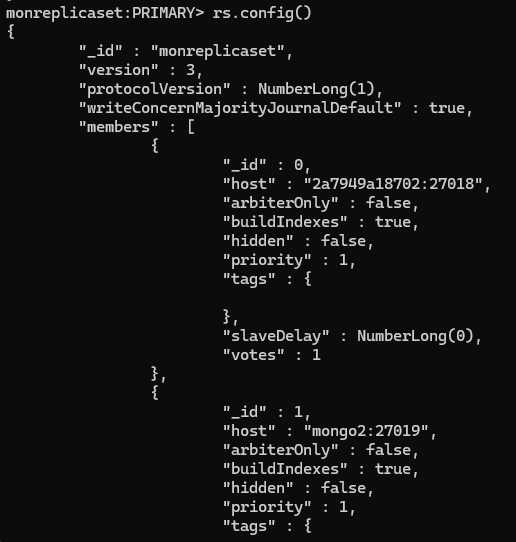

# TP n°2, Réplication et tolérance aux pannes avec MongoDB et Cassandra

## Partie 1 — Compréhension de base

1. Qu’est-ce qu’un Replica Set dans MongoDB ?
   
Un Replica Set est un groupe de serveurs MongoDB qui contiennent la même copie des données.

Il garantit :

- la tolérance aux pannes,

- la haute disponibilité,

- la sécurité des données

Un Replica Set comporte :

- 1 Primary : nœud principal qui reçoit toutes les écritures

- 1 ou plusieurs Secondaries : nœuds répliqués

<div style="text-align: center;">
  
</div>


1. Quel est le rôle du Primary dans un Replica Set ?
   
   `Le Primary est le nœud principal du Replica Set : c’est le seul nœud qui reçoit les écritures (insert, update, delete), par défaut, il sert de source pour les lectures, il réplique ensuite les modifications vers les nœuds Secondary pour qu’ils restent à jour.`
   
2. Quel est le rôle essentiel des Secondaries ?
   
   `Répliquer les données du Primary pour maintenir une copie à jour des données`

    `Assure aussi la tolérance aux pannes : en cas de panne du Primary, un Secondary peut être élu nouveau Primary.`

3. Pourquoi MongoDB n’autorise-t-il pas les écritures sur un Secondary ?
 
   `C'est pour éviter les conflits d’écriture et garantir : un ordre unique des opérations, la cohérence des données.`   `MongoDB interdit les écritures sur les Secondary pour Simplifier la réplication asynchrone : les Secondary ne font que rejouer le journal du Primary, ils ne prennent pas de décisions d’écriture eux-mêmes.`
   `Pas d’écriture sur les Secondaries = pas de conflits à réconcilier, cohérence plus simple à garantir.`

4. Qu’est-ce que la cohérence forte dans le contexte MongoDB ?
   
   `C’est la garantie que toute lecture sur le Primary renvoie la donnée la plus récente immédiatement après une écriture.`

5. Quelle est la différence entre readPreference : "primary" et "secondary" ?
   
    `primary : garantit une lecture toujours à jour car elle se fait sur le Primary (cohérence forte).`

    `secondary : permet de répartir les lectures mais peut retourner des données obsolètes à cause de la réplication asynchrone(cohérence à terme, pas forte).`

6. Dans quel cas pourrait-on souhaiter lire sur un Secondary malgré les risques ?
   
    On peut choisir de lire sur un Secondary quand :

    - on veut décharger le Primary parce qu’il reçoit déjà beaucoup d’écritures et de lectures,

    - on a des requêtes de consultation / reporting / statistiques où une donnée légèrement en retard n’est pas grave,

    - on privilégie la scalabilité en lecture plutôt que la cohérence forte (cohérence à terme suffisante),

     - On lit sur un Secondary quand on accepte le risque de données un peu obsolètes pour gagner en performance et en disponibilité.`

## Partie 2 — Commandes & configuration

Avant de repondre aux questions j'ai crée 3 serveurs et un client: 

<div style="text-align: center;">
  
</div>

On se connecte: 

<div style="text-align: center;">
        
    </div>


8. Quelle commande permet d’initialiser un Replica Set ?
   
   
    ```
    rs.initiate()
    ```

9.  Comment ajouter un nœud à un Replica Set après son initialisation ?
    
    ```
    rs.add("mongo2:27017")
    rs.add("mongo3:27017")
    ```
    <div style="text-align: center;">
    
    </div>


10. Quelle commande permet d’afficher l’état actuel du Replica Set ?

`rs.status()` utile pour afficher l’état actuel du Replica Set (quel nœud est PRIMARY, lesquels sont SECONDARY ou ARBITRE, etc.) et donc pour surveiller le bon fonctionnement du cluster en temps réel.

```
rs.status()
```




11.  Comment identifier le rôle actuel (Primary / Secondary / Arbitre) d’un nœud ?
    
On exécute `rs.status()` puis on regarde, pour chaque membre, le champ
stateStr : si PRIMARY nœud primaire ou SECONDARY : nœud secondaire ou ARBITER : arbitre

Ou bien : 

```
    rs.isMaster()
```



12. Quelle commande permet de forcer le basculement du Primary ?    
    
`rs.stepDown()` : permet de forcer le nœud Primary à laisser sa place, et ce qui déclenche une élection pour choisir un nouveau Primary parmi les Secondary

`rs.stepDown(60)`: on ajoute un délai pendant lequel l’ancien Primary ne pourra pas être réélu




1.  Comment peut-on désigner un nœud comme Arbitre ? Pourquoi le faire ?

`rs.addArb("hostname:port")`  
Un arbitre ne stocke pas de données, mais il participe au vote lors de l’élection du Primary. On l’ajoute pour : atteindre une majorité de votes plus facilement (surtout avec un nombre pair de nœuds de données), éviter que le cluster se bloque en cas de panne ou de partition réseau. Et améliore donc la tolérance aux pannes sans consommer d’espace disque pour les données.



14. Donnez la commande pour configurer un nœud secondaire avec un délai de réplication
    
`rs.config()` est une commande utile pour afficher la configuration du Replica Set (liste des membres, adresses/ports, priorités, votes, éventuel slaveDelay…), et donc pour vérifier ou modifier la configuration du cluster.

```
cfg.members[1].slaveDelay = 60   
cfg.members[1].priority = 0      
rs.reconfig(cfg)
```






## Partie 3 — Résilience et tolérance aux pannes
15. Que se passe-t-il si le Primary tombe en panne et qu’il n’y a pas de majorité ?
    
16. Comment MongoDB choisit-il un nouveau Primary ? Quels critères utilise-t-il ?
    
17. Qu’est-ce qu’une élection dans MongoDB ?
    
18. Que signifie auto-dégradation du Replica Set ? Dans quel cas cela survient-il ?
    
19. Pourquoi est-il conseillé d’avoir un nombre impair de nœuds dans un Replica Set ?
    
20. Quelles conséquences a une partition réseau sur le fonctionnement du cluster ?

## Partie 4 — Scénarios pratiques

21. Vous avez 3 nœuds : 27017 (Primary) , 27018 (Secondary) , et 27019 (Arbitre) .
Que se passe-t-il si le Primary devient injoignable ?

22. Vous avez configuré un Secondary avec un slaveDelay de 120 secondes.
Quelle est son utilité ? Quels usages peut-on en faire dans la vraie vie ?

23. Un client exige une lecture toujours à jour, même en cas de bascule.
Quelles options de readConcern et writeConcern recommanderiez-vous ?

24. Dans une application critique, vous voulez garantir que l’écriture est confirmée par au
moins deux nœuds.
Quelle option de writeConcern devez-vous utiliser ?
25. Un étudiant a lu depuis un Secondary et récupéré une donnée obsolète. Expliquez pourquoi
et comment éviter cela.
26. Montrez la commande pour vérifier quel nœud est actuellement Primary dans votre Replica
Set.
27. Expliquez comment forcer une bascule manuelle du Primary sans interruption majeure.
28. Décrivez la procédure pour ajouter un nouveau nœud secondaire dans un Replica Set en
fonctionnement.
29. Quelle commande permet de retirer un nœud défectueux d’un Replica Set ?
30. Comment configurer un nœud secondaire pour qu’il soit caché (non visible aux clients) ?
Pourquoi ferait-on cela ?
31. Montrez comment modifier la priorité d’un nœud afin qu’il devienne le Primary préféré.
32. Expliquez comment vérifier le délai de réplication d’un Secondary par rapport au Primary.
Questions complémentaires
33. Que fait la commande rs.freeze() et dans quel scénario est-elle utile ?
34. Comment redémarrer un Replica Set sans perdre la configuration ?
35. Expliquez comment surveiller en temps réel la réplication via les logs MongoDB ou
commandes shell

## Questions complémentaires

37. Qu’est-ce qu’un Arbitre (Arbiter) et pourquoi ne stocke-t-il pas de données ?
38. Comment vérifier la latence de réplication entre le Primary et les Secondaries ?
39. Quelle commande MongoDB permet d’afficher le retard de réplication des membres
secondaires ?
40. Quelle est la différence entre la réplication asynchrone et synchrone ? Quel type utilise
MongoDB ?
41. Peut-on modifier la configuration d’un Replica Set sans redémarrer les serveurs ?
42. Que se passe-t-il si un nœud Secondary est en retard de plusieurs minutes ?
43. Comment MongoDB gère-t-il les conflits de données lors de la réplication ?
44. Est-il possible d’avoir plusieurs Primarys simultanément dans un Replica Set ? Pourquoi ?
45. Pourquoi est-il déconseillé d’utiliser un Secondary pour des opérations d’écriture même en
lecture préférée secondaire ?
46. Quelles sont les conséquences d’un réseau instable sur un Replica Set 

## Réferences : 

https://www.mongodb.com/docs/manual/replication/