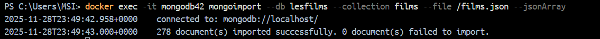
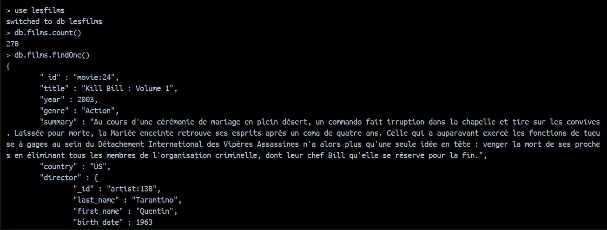
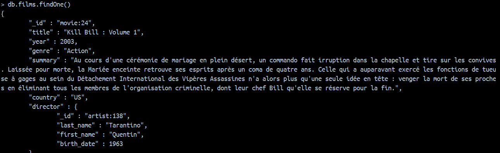
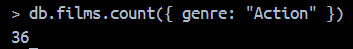
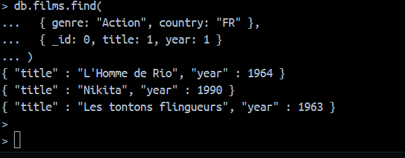
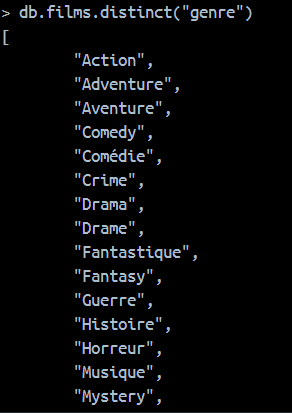
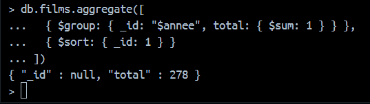
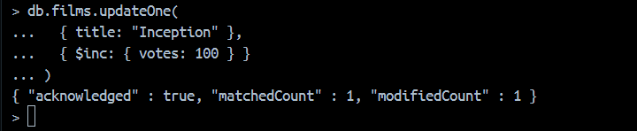
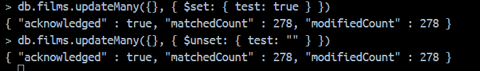

# Partie 1 — Filtrer et projeter les données

## import Data Films



---
##  Vérification de l’importation des données dans MongoDB




## 1. Compter le nombre total de films importés
```mongodb
db.films.count()
```

---

## 2. Examiner la structure d’un document
```mongodb
db.films.findOne()
```


---

## 3. Afficher les films d’action
```mongodb
db.films.find({ genre: "Action" })
```

---

## 4. Nombre de films d’action
```mongodb
db.films.count({ genre: "Action" })
```



---

## 5. Films d’action produits en France
```mongodb
db.films.find({ genre: "Action", country: "France" })
```

---

## 6. Films d’action produits en France en 1963
```mongodb
db.films.find({
  genre: "Action",
  country: "France",
  year: 1963
})

```


## 7. Supprimer l’affichage de _id
```mongodb
db.films.find(
  { genre: "Action", country: "FR" },
  { _id: 0, summary: 0 }
)

```

---

## 8. Afficher uniquement le titre et l’année
```
db.films.find(
  { genre: "Action", country: "FR" },
  { _id: 0, title: 1, year: 1 }
)

```


---

## 10. Films d’action français ayant une note > 10
```mongodb
db.films.find(
  {
    genre: "Action",
    country: "FR",
    "grades.note": { $gt: 10 }
  },
  { _id: 0, title: 1, grades: 1 }
)

```

---

## 11. Films dont toutes les notes sont > 10
```mongodb
db.films.find({
  grades: { $not: { $elemMatch: { note: { $lte: 10 } } } }
})

```

---

## 12. Afficher tous les genres disponibles
`db.films.distinct("genre")`



---

## 13. Afficher tous les grades disponibles
```mongodb
db.films.distinct("grades.grade")
```

---

## 14. Films contenant au moins un des artistes donnés
```mongodb
db.films.find({
  artistes: { $in: ["artist:4", "artist:18", "artist:11"] }
})

```
```

db.films.find({
  "actors.last_name": { $in: ["Pacino", "Grant", "Belmondo"] }
})
```
---

## 15. Films sans résumé
`db.films.find({ resume: { $exists: false } })`

Avec resumé

`db.films.find({ resume: { $exists: false } })`

---

## 16. Films avec Leonardo DiCaprio en 1997
```mongodb
db.films.find({
  acteurs: "Leonardo DiCaprio",
  annee: 1997
})
```

---

## 17. Films avec Leonardo DiCaprio OU films de 1997
```mongodb
db.films.find({
  $or: [
    { acteurs: "Leonardo DiCaprio" },
    { annee: 1997 }
  ]
})
```

---

# Partie 2 — Agrégations MongoDB


## Nombre de films par année
```mongodb
db.films.aggregate([
  { $group: { _id: "$annee", total: { $sum: 1 } } },
  { $sort: { _id: 1 } }
])
```



##  Nombre de films par pays
```mongodb
db.films.aggregate([
  { $group: { _id: "$country", total: { $sum: 1 } } },
  { $sort: { total: -1 } }
])

```

---

# Partie 3 — Mises à jour

## Incrémenter le nombre de votes
```mongodb
db.films.updateOne(
  { title: "Inception" },
  { $inc: { votes: 100 } }
)


```

##  Ajouter et Supprimer un champ
`db.films.updateMany({}, { $set: { test: true } })`

```mongodb
db.films.updateMany(
  {},
  { $unset: { poster: "" } }
)
```


Ce TP m'a permis de comprendre le fonctionnement d’une base NoSQL orientée documents, la flexibilité offerte par MongoDB dans la gestion de data.