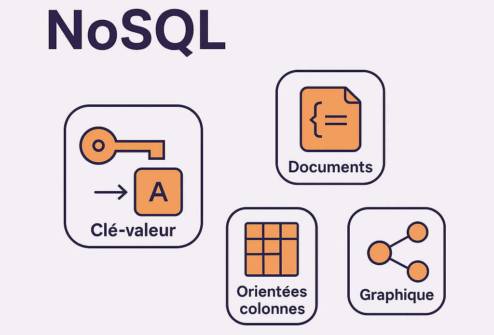
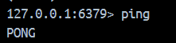

# Présentation des bases de données NoSQL puis Redis

## NoSQL

Le terme NoSQL fait référence aux bases de données non relationnelles qui stockent des données dans un format non tabulaire, plutôt que dans des tables relationnelles basées sur des règles, comme le font les bases de données relationnelles (MySQL, Postgres, etc.). Les bases de données NoSQL utilisent un modèle de schéma flexible qui accepte une grande variété de données non structurées, telles que des documents, des clé-valeurs, des colonnes larges et des graphiques. Les BDs NoSQL sont conçus pour gérer de gros volumes de données distribuées sur plusieurs serveurs.

Il existe différents types de modèles de bases de données NoSQL :




**Clé-valeur**

Les données sont stockées sous forme de paires clé-valeur. Idéal pour des cas simples où chaque clé unique fait référence à une valeur spécifique. _e.g_ : Redis, Amazon DynamoDB.

 **Documents**

Les données sont stockées sous forme de documents semi-structurés (JSON, BSON, XML, etc.). Idéal pour les applications web et mobiles. _e.g_ : MongoDB, Couchbase.

**Orientées colonnes**

Les données sont organisées en colonnes plutôt qu’en lignes. Convient pour les analyses rapides de grandes quantités de données. _e.g_ : Apache Cassandra, HBase.

**Graphe**

Les données sont représentées sous forme de graphes. _e.g_ : Neo4j, ArangoDB.

**Série temporelle**

Une base de données de séries temporelles (_Time series database_) est un type de base de données NoSQL conçus pour organiser des informations mesurées dans le temps. Particulièrement présent dans l’**IoT**. La BD la plus utilisée dans cette catégorie est _InfluxDB_ (utilisé par Tesla).

## Redis

Redis est une BD NoSQL clé/valeur en mémoire open source rapide. Redis propose un ensemble de structures de données en mémoire polyvalentes qui permet de créer facilement un large éventail d'applications personnalisées.
Les principaux cas d'utilisation de Redis comprennent la mise en cache, la gestion des sessions. C'est la BD NoSQL clé/valeur la plus populaire à l'heure actuelle. Il est distribué sous licence BSD, écrit en code C optimisé. Redis est l'acronyme de _REmote DIctionary Server_. L'avantage n°1 de Redis est qu'il stocke les données dans la RAM de la machine. Ce qui rend l'accès aux données extrêmement rapide mais non persistant (par défaut).

Pour installer Redis avec Docker :
` docker run --name redis -p 6379:6379 -d redis  `


Pour vérifier que votre installation fonctionne 
 `docker ps `

Se connecter au serveur Redis:
` docker exec -it redis redis-cli`

Pour voir si redis reponds:



## Manipulation Redis

1. Commandes Redis exécutées
### SET / GET — Création et lecture de clés
SET demo "bonjour"
GET demo


Redis renvoie OK puis "bonjour", confirmant la création de la clé.

```
SET user:1234 "Amira"
GET user:1234
```

2. Suppression d’une clé (DEL)
```
DEL user:1234
GET user:1234
```

Redis renvoie (nil) car la clé a été supprimée.

1. Incrémentation et décrémentation (INCR / DECR)
   
`SET 25nov 0`

`INCR 25nov`

`INCR 25nov`

`INCR 25nov`

`DECR 25nov`

Redis met automatiquement la valeur à jour après chaque opération.

1. Expiration d'une clé (EXPIRE / TTL)
   
```
EXPIRE macle 180
TTL macle
```

Manipulation des listes (RPUSH, LRANGE, LPOP)

Dans Redis, les listes permettent de stocker des éléments ordonnés. Avec RPUSH, j’ai ajouté des valeurs à la fin de la liste mesCours. <br>
La commande LRANGE m’a permis d’afficher le contenu de la liste, et LPOP a retiré le premier élément tout en me le renvoyant.<br>
Ces opérations montrent comment Redis gère les listes, comme une file (queue) où les éléments s’ajoutent et se retirent rapidement.


```
RPUSH mesCours "ia"
RPUSH mesCours "nosql"
LRANGE mesCours 0 -1
LPOP mesCours
LRANGE mesCours 0 -1
```
Manipulation des ensembles `SET / SADD / SMEMBERS`
Les ensembles (sets), eux, stockent des valeurs uniques sans ordre particulier. Grâce à SADD, j’ai ajouté plusieurs noms dans le set user. Enfin, la commande SMEMBERS m’a permis d’afficher l’ensemble des valeurs stockées. Cela montre l’utilité des sets pour gérer des collections sans doublons, comme des listes d’utilisateurs ou des tags.

```
SADD user "amira"
SADD user "chayma"
SADD user "zeineb"
SADD user "amani"
SMEMBERS user 
```

