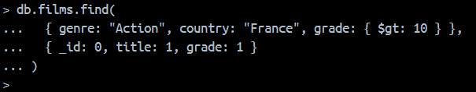
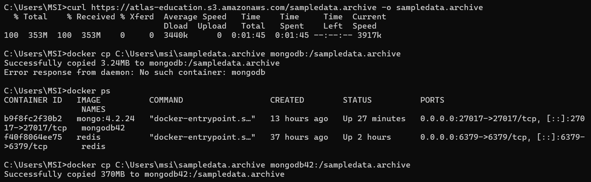
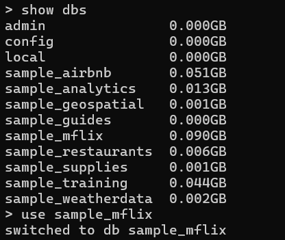
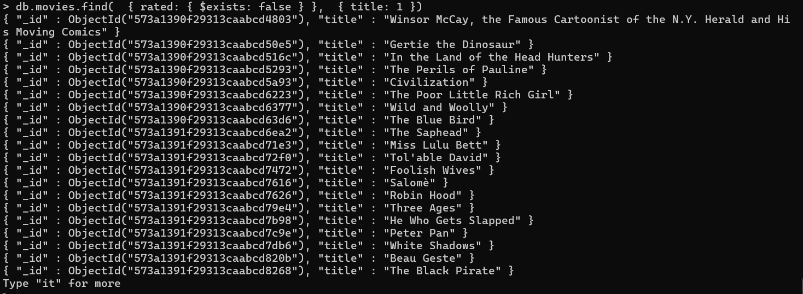
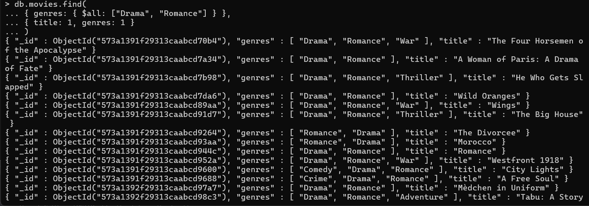

# Prise en main de MongoDB  


## Introduction à MongoDB

MongoDB est un système de gestion de bases de données NoSQL orienté documents.  
Contrairement aux bases relationnelles qui utilisent des tables et un schéma strict, MongoDB stocke les données sous forme de documents JSON/BSON.

## Qu'est-ce qui caractérise MongoDB ?

- Base de données NoSQL orientée documents  
- Structure flexible sans schéma fixe  
- Stockage des données en JSON/BSON  
- Capacité de gérer de grands volumes de données distribuées  

## Installation de MongoDB 



##  Importation des données




```
curl https://atlas-education.s3.amazonaws.com/sampledata.archive -o sampledata.archive


```
```
docker cp C:\Users\msi\sampledata.archive mongodb42:/sampledata.archive

```

```
docker exec -it mongodb42 mongorestore --archive=sampledata.archive
```



---

# Partie 1 – Filtrer et projeter les données

## 1. Afficher les 5 films sortis depuis 2015

`db.movies.find({ year: { $gte: 2015 } }).limit(5)`

On filtre les films récents (>=2015) et on limite à 5 résultats pour obtenir un aperçu.



## 2. Films dont le genre est "Comedy"

`db.movies.find({ genres: "Comedy" })`

L’opérateur recherche tout document dont le tableau genres contient "Comedy".


## 3. Films sortis entre 2000 et 2005

Projection pour n’afficher que le titre + année.
```
db.movies.find(
{ year: { $gte: 2000, $lte: 2005 } },
{ title: 1, year: 1 }
).pretty()
```


## 4. Films de genres “Drama” ET “Romance”

`$all` impose la présence simultanée des deux genres.

```
db.movies.find(
{ genres: { $all: ["Drama", "Romance"] } },
{ title: 1, genres: 1 }
)

```


## 5. Films sans champ rated
Utile pour identifier les documents incomplets.

```
db.movies.find(
{ rated: { $exists: false } },
{ title: 1 }
)

```
---
# Partie 2 – Agrégation

## 6. Nombre de films par année
Permet de visualiser la production cinématographique par année.
```

db.movies.aggregate([
{ $group: { _id: "$year", total: { $sum: 1 } } },
{ $sort: { _id: 1 }}
])

```

## 7. Moyenne des notes IMDb par genre
`$unwind` éclate le tableau genres.  
On obtient le genre avec la meilleure moyenne IMDb.
```

db.movies.aggregate([
{ $unwind: "$genres" },
{ $group: { _id: "$genres", moyenne: { $avg: "$imdb.rating" } } },{ $sort: { moyenne: -1 }}])
```

## 8. Nombre de films par pays
Identifie les pays les plus producteurs de films.

```
db.movies.aggregate([
{ $unwind: "$countries" },
{ $group: { _id: "$countries", total: { $sum: 1 } } },
{ $sort: { total: -1 }}
])
```

## 9. Top 5 réalisateurs

```
db.movies.aggregate([
{ $unwind: "$directors" },
{ $group: { _id: "$directors", total: { $sum: 1 } } },
{ $sort: { total: -1 }},
{ $limit: 5 }
])
```

## 10. Films triés par note IMDb

```
db.movies.aggregate([
{ $sort: { "imdb.rating": -1 }},
{ $project: { title: 1, "imdb.rating": 1 }}
])
```

---
# Partie 3 – Mises à jour

## 11. Ajouter un champ etat

```
db.movies.updateOne(
{ title: "Jaws" },
{ $set: { etat: "culte" }}
)
```

## 12. Incrémenter les votes IMDb

```

db.movies.updateOne(
{ title: "Inception" },
{ $inc: { "imdb.votes": 100 }}
)

```

## 13. Supprimer le champ poster


`db.movies.updateMany({}, { $unset: { poster: "" }})`

## 14. Modifier le réalisateur


```
db.movies.updateOne(
{ title: "Titanic" },
{ $set: { directors: ["James Cameron"] }}
)
```
---

# Partie 4 – Requêtes complexes

## 15. Films les mieux notés par décennie


```
db.movies.aggregate([
{ $match: { "imdb.rating": { $exists: true }}},
{ $project: {
title: 1,
decade: { $subtract: ["$year", { $mod: ["$year", 10]}]},
"imdb.rating": 1
}},
{ $group: { _id: "$decade", maxRating: { $max: "$imdb.rating" }}},
{ $sort: { _id: 1 }}
])

```


## 16. Films dont le titre commence par “Star”


`db.movies.find({ title: /^Star/ }, { title: 1 })`


## 17. Films avec plus de 2 genres


```db.movies.find(
{ $where: "this.genres.length > 2" },
{ title: 1, genres: 1 }
)```


## 18. Films de Christopher Nolan

```db.movies.find(
{ directors: "Christopher Nolan" },
{ title: 1, year: 1, "imdb.rating": 1 }
)
```

# Partie 5 – Indexation

## 19. Créer un index sur year

`db.movies.createIndex({ year: 1 })`


## 20. Voir les index existants

`db.movies.getIndexes()`


## 21. Comparer les requêtes avec / sans index


```
db.movies.find({ year: 1995 }).explain("executionStats")
```

Avec index :  
- moins de documents parcourus,  
- exécution plus rapide.

## 22. Supprimer l’index

`db.movies.dropIndex({ year: 1 })`


## 23. Créer un index composé


```
db.movies.createIndex({ year: 1, "imdb.rating": -1 })

```

